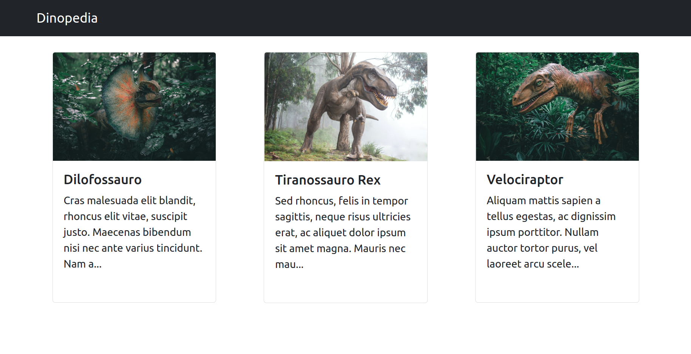

# Dino App with React Typescript Django Tutorial 

Este é um projeto com Django Rest Framework e React + Typescript para uma imersão em desenvolvimento web na UFTM.



## Requisitos

- python 3.8
- Windows 10

## Setup inicial

- Os comandos a seguir devem ser digitados no terminal:

```bash
mkdir dinopedia
cd dinopedia
python -m venv env
. env/Scripts/activate (Windows) ou
source env/bin/activate (Linux)
pip install django
pip install djangorestframework
pip install pillow
django-admin startproject core .
```

- Para testar digitar `python manage.py runserver` no terminal e, depois no navegador de internet, digitar _http://localhost:8000_

## Criando o Models do app e adicionando ao admin

- Digitar no terminal `python manage.py startapp dinosaurs`
- Incluir `'rest_framework'` e `'dinosaurs'` em `INSTALLED_APPS`, no arquivo _settings.py_
- Criar o model do app em _dinosaurs/models.py_
- Liberar o model criado para o admin em _dinousaurs/admin.py_
- Fazer as migrations e executar as mesmas, em seguida criar o superuser. Para isso, no terminal:

```bash
python manage.py makemigrations
python manage.py migrate
python manage.py createsuperuser
```

- Para testar digitar `python manage.py runserver` no terminal e, depois no navegador de internet, digitar _http://localhost:8000/admin_
- Adicione 2 dinossauros para teste.

## Criando views para a api

- Criar serializers em _dinosaurs/serializers.py_
- Criar view para **Listar** dinossauros (existe várias formas de fazer)
- Criar url em _dinosaurs/urls.py_ para acessar a view criada
- Criar url em _core/urls.py_ para redirecionar para url do passo anterior
- Para testar digitar `python manage.py runserver` no terminal e, depois no navegador de internet, digitar _http://localhost:8000/api/dinosaurs_

## Renderizando arquivos estáticos em desenvolvimento

- No arquivo _core/urls.py_ adicione:

```python
from django.conf import settings
from django.conf.urls.static import static

urlpatterns += static(settings.STATIC_URL, document_root=settings.STATIC_ROOT)
```

- No arquivo _core/settings.py_ adicione:

```python
import os

STATICFILES_DIRS = (os.path.join(BASE_DIR, 'static'), )
STATIC_ROOT = os.path.join(BASE_DIR, 'staticfiles')
```

- Para testar digitar `python manage.py runserver` no terminal e, depois no navegador de internet, digitar _http://localhost:8000/api/dinosaurs_. Entre em alguma url apresentada no campo "photo". A imagem deve ser mostrada no navegador.

## Setup do frontend com React

- No terminal: `npx create-react-app frontend --template typescript`
- Para testar digitar `yarn start`no terminal estando na pasta _frontend_ e, depois, no navegador de internet, digitar _http://localhost:3000_.

## Configurando o github

- Em _dinopedia_ salve o arquivo <a href="https://github.com/github/gitignore/blob/master/Python.gitignore">_.gitignore_</a>
- Delete .git de _frontend_
- Em _dinopedia_, no terminal:
```
pip freeze > requirements.txt
git init
git add .
git commit -m first commit
```

## Criando a Home page de lista de dinossauors com React

Para os seguintes passos, crie todos estáticos.

- Crie o componente DinousaurCard em _frontend/src/components/DinousaurCard/index.tsx_
- Crie o componente DinousaurList em _frontend/src/components/DinousaurList/index.tsx_
- Cria a página Home em _frontend/src/pages/Home/index.tsx_
- Editar o arquivo _frontend/src/App.tsx_ para renderizar Home

Não esqueça de testar se tudo está funcionando. Faça um novo commit!

## Estilos com bootstrap

- No terminal: `yarn add react-bootstrap bootstrap@5.1.3`
- Em _src/index.tsx_: `import 'bootstrap/dist/css/bootstrap.min.css';`
- Refatore o código usando componentes do bootstrap

## Django cors Headers

- No terminal: `pip install django-cors-headers`
- No settings: 
```python
INSTALLED_APPS = [
    ...,
    "corsheaders",
    ...,
]
```
- No settings: `CORS_ALLOWED_ORIGINS=["http://localhost:3000"]`
- No settings: 
```python
MIDDLEWARE = [
    ...,
    "corsheaders.middleware.CorsMiddleware",
    "django.middleware.common.CommonMiddleware",
    ...,
]
```

## Carregando dados da api no frontend

- Instale o axios e crie o serviço de api
- Adicione o "proxy" em _package.json_ o valor:
```
"http://127.0.0.1:8000"
```
- Edite o componente DinosaurItem para receber valores dinâmicos
- Edite o componente DinosaurList para carregar valores da api

## Conectando Django e React

- Faça o build do projeto React: `yarn build`
- Em _settings.py_:
```python
import os

TEMPLATES = [
    {
        ...,
        'DIRS': [os.path.join(BASE_DIR, 'frontend/build')],
        ...,
    }

STATIC_URL = '/static/'
STATIC_ROOT = os.path.join(BASE_DIR, 'staticfiles')
STATICFILES_DIRS = (
    os.path.join(BASE_DIR, 'frontend/build/static'),
    BASE_DIR / 'static'
)
```
- Em _core/urls.py_:
```python
from django.views.generic import TemplateView

urlpatterns = [
    ...,
    path('', TemplateView.as_view('index.html'))    
]
```
